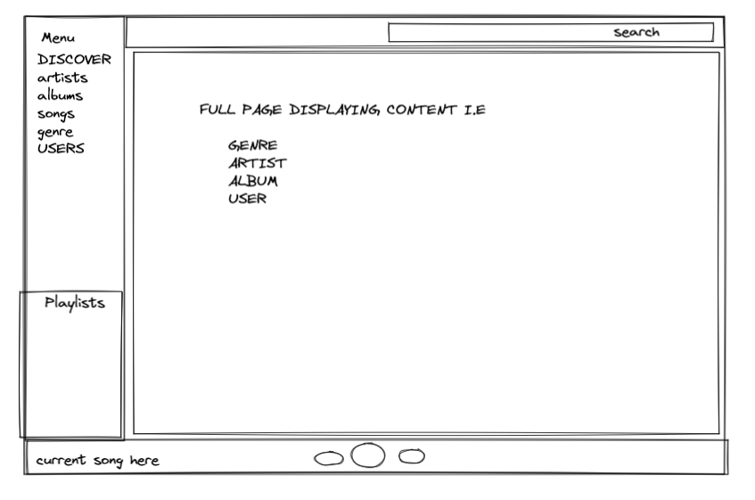
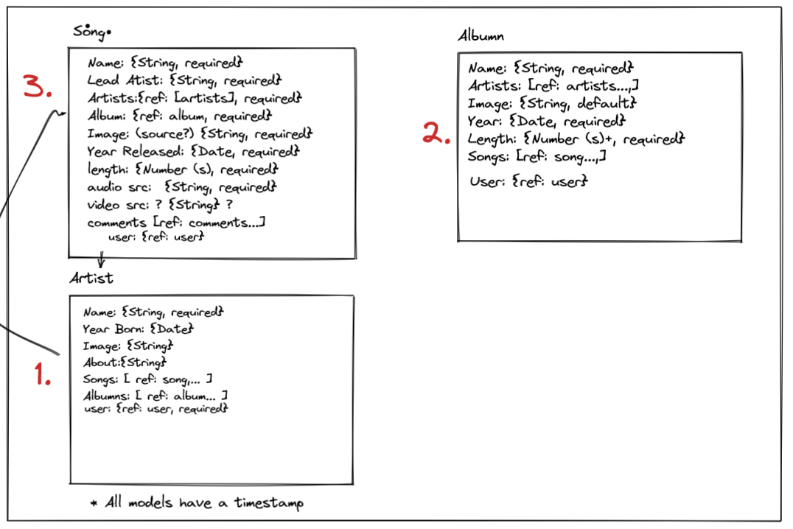
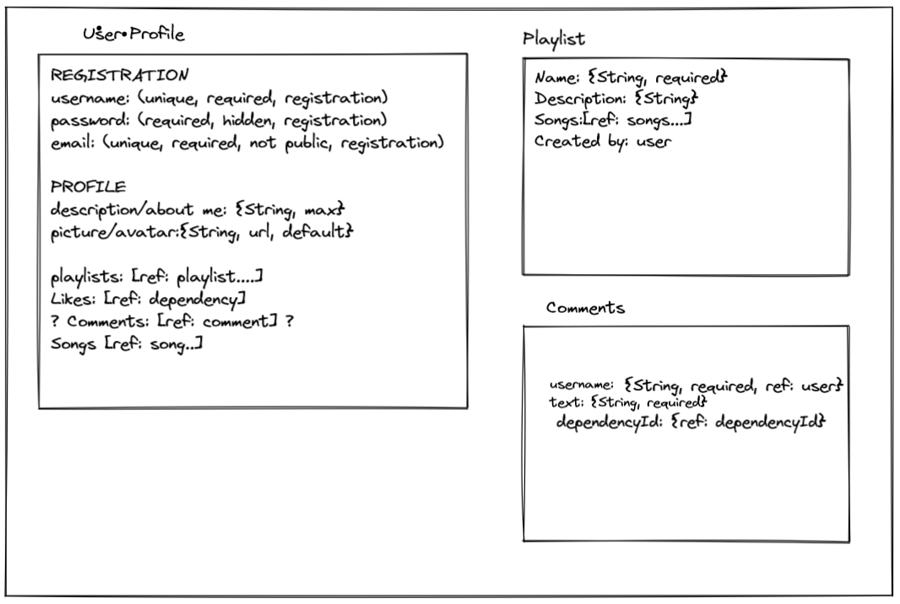
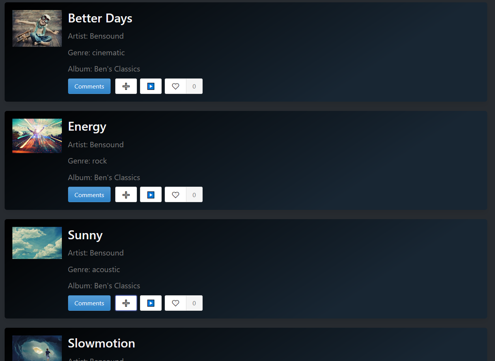
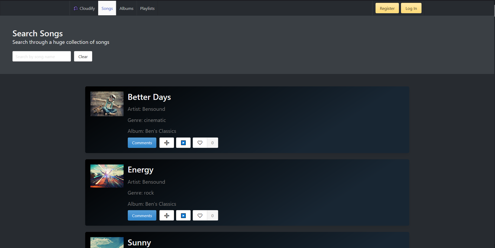
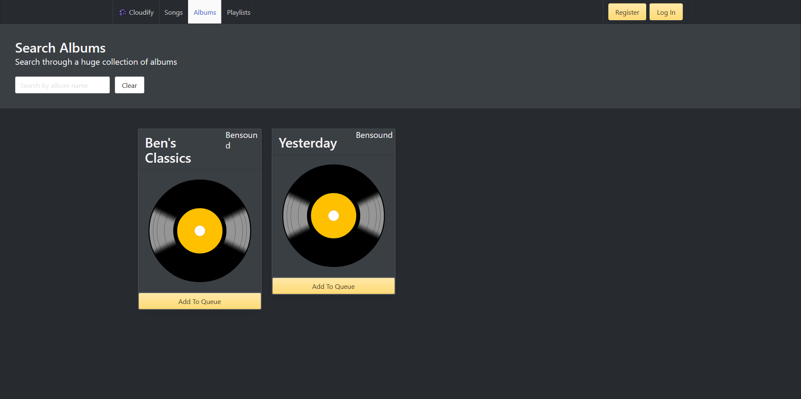
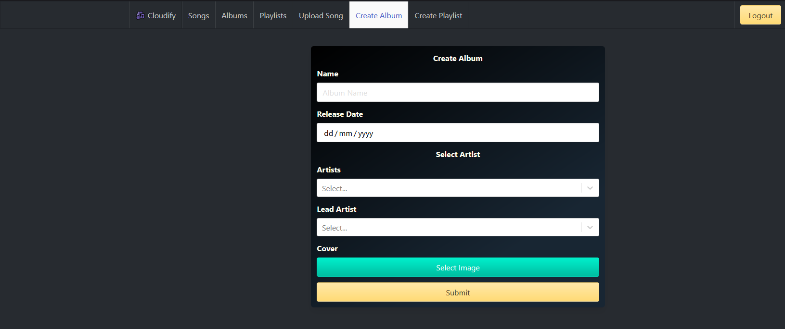
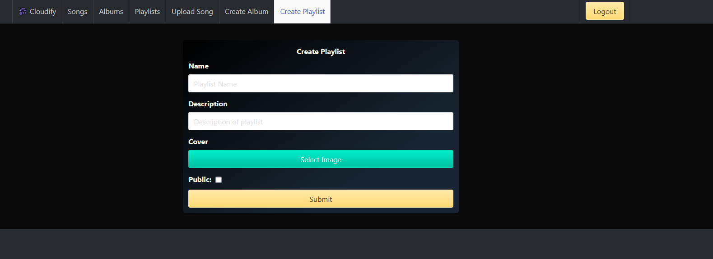

# Cloudinary

In collaboration with [Guy Kozlovskij](https://github.com/guykozlovskij) & [Steven Saunders](https://github.com/SuperSuperStore), could not have gotten this far into the project without their help and support.

Frontend [here](https://github.com/Aliwebs/project-3-client)

## Table of contents-

- [Cloudinary](#cloudinary)
  - [Table of contents-](#table-of-contents-)
- [Brief](#brief)
  - [Summary](#summary)
- [Technologies Used](#technologies-used)
- [Approach](#approach)
  - [Design](#design)
      - [Homepage](#homepage)
      - [Songs Page](#songs-page)
      - [Single Song item component prototype](#single-song-item-component-prototype)
  - [Backend](#backend)
  - [Frontend](#frontend)
- [Screenshots](#screenshots)
- [Bugs](#bugs)
- [Future Features](#future-features)
- [Key Learnings](#key-learnings)

# Brief

- Build a full-stack application by making our own backend and frontend
- Work in a team using Git to code collaboratively
- Use an Express API to serve our data from a Mongo database
- Consume the API with a frontend built with REACT
- Have a complete product with multiple relationships and CRUD functionality for at least a couple of models

## Summary

This was a project inspired by Spotify and SoundCloud, so it's a combination of both. On Cloudify you can upload songs, create albums, create playlists. The other part is that users can listen to songs on the website. We used a 3rd party music player plugin called [react-jinke-music-player](https://www.npmjs.com/package/react-jinke-music-player).

# Technologies Used

- React
- HTML5
- JavaScript
- SASS
- Bulma
- Express
- Node.js
- Mongoose
- MongoDB
- Heroku
- Netlify
- Git & Github

# Approach

## Design

We wanted to keep things simple for the design as we had a lot to do in the backend for this project. Below you can see a few prototypes we made as a group for how we wanted the pages to look like. We used excalidraw to plan out the project, the planning was quite extensive. So I will reference it through this document where relevant.

#### Homepage

---


#### Songs Page

---



#### Single Song item component prototype

---


## Backend

For the backend we started by creating all the required models, to do that we planned all the models our website has as show below:




Then we coded all the models in the backend, I am not going to show all of them here, but this is the song model:

```javascript
const songSchema = new mongoose.Schema({
  name: { type: String, required: true },
  genre: { type: String },
  singer: { type: mongoose.Schema.ObjectId, ref: "Artist", required: true },
  cover: {
    type: String,
    default: "https://image.flaticon.com/icons/png/512/26/26433.png",
  },
  year: { type: Date, required: true },
  source: { type: String },
  musicSrc: { type: String },
  length: { type: Number },
  album: { type: mongoose.Schema.ObjectId, ref: "Album" },
  artists: [{ type: mongoose.Schema.ObjectId, ref: "Artist" }],
  comments: [commentSchema],
  likesCount: { type: Number, default: 0 },
  user: { type: mongoose.Schema.ObjectId, ref: "User" },
  isDeleted: { type: Boolean, default: false, required: true },
});
```

We also added functions like adding an album to the database, for that we made controllers, like the one below.

```javascript
//! Create an album
async function add(req, res, next) {
  try {
    req.body.user = req.currentUser;
    const album = await Album.create(req.body);
    res.status(200).json(album);
  } catch (err) {
    next(err);
  }
}
```

There are also controllers responsible for each of the RESTful actions.

## Frontend

The front end consists mainly of the song list and song component which is rendered in different ways throughout the application. The song data is fetched in the `songIndex` file in the useEffect and passed down to the `songList` and `songListItem`.

```javascript
React.useEffect(() => {
  const getData = async () => {
    try {
      const response = await getAllSongs();
      setAllSongs(response.data);
    } catch (err) {
      console.log(err);
      history.push("./error");
    }
  };
  getData();
}, [setAllSongs, history]);
```

Which then is passed down to the `songList` component.

```javascript
<SongList songList={filteredSongs} />
```

Which then iterates through all the songs and calls each of them by using the songListItem component.

```javascript

 {filteredSongList ? (
            filteredSongList.map((song) => (
              <div key={song._id} className="column is-full">
                <SongListItem  {...song} />
              </div>
            ))
          ) : (
            <div id="loader">
              <Loader
                type="Puff"
                color="#00BFFF"
                height={150}
                width={150}
                timeout={3000} //3 secs
              />
            </div>
          )}
        </div>
      </div>
    </div>
  )
}

```

This results in this list of songs:



The `songListItem` has a further child component called `ControlBar`.

The `controlBar` component further has a playBtn component which the song when clicked, it works by calling the `updateAudioQueue` function which updates the `audioQueue` state in `App.js`, which in turn passes that list to the `react-jinke-music-player`, which is the third party player we used to play all the audio.

```javascript
function PlayBtn({ name, singer, cover, musicSrc }) {
  const { updateAudioQueue } = React.useContext(AudioQueueContext);
  const handleClick = () => {
    const song = {
      name: name,
      singer: singer.name,
      cover: cover,
      musicSrc: musicSrc,
    };

    updateAudioQueue([song], true);
  };

  return (
    <button className="button" onClick={handleClick}>
      ▶️
    </button>
  );
}
```

# Screenshots

Songs Page

Album Page

Playlist Page

Song Upload Page

Create Album

Create Playlist


# Bugs

One of the few bugs that there is in the application is that sometimes the 3rd party player goes into an infinite loading state without playing the selected song.

# Future Features

- Allowing sorting by genre, author or other parameters
- Improving the design of the forms and the song list to allow for a better user experience.

# Key Learnings

I learned a lot during this project, one of which is how to better work as a team member, schedule tasks and meetings. I also learned how to implement the shadowDelete feature alongside Guy who helped me greatly when we were implementing this feature.
