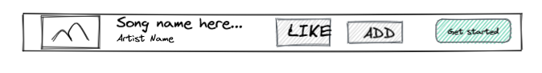
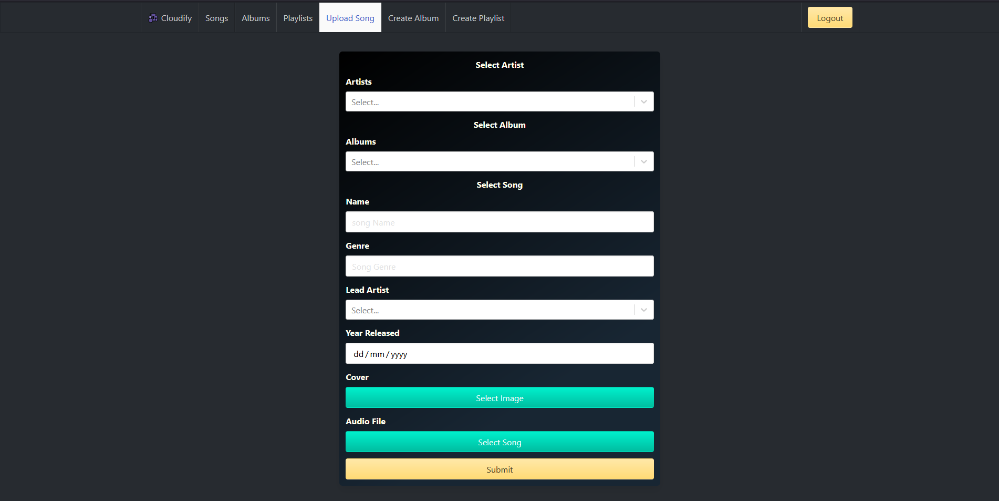

# [Cloudinary](https://sei-cloudinary.netlify.app/)

In collaboration with [Guy Kozlovskij](https://github.com/guykozlovskij) & [Steven Saunders](https://github.com/SuperSuperStore), could not have gotten this far into the project without their help and support.

Frontend [here](https://github.com/Aliwebs/project-3-client)

## Table of contents

- [Cloudinary](#cloudinary)
  - [Table of contents](#table-of-contents)
  - [Brief](#brief)
  - [Summary](#summary)
  - [Technologies Used](#technologies-used)
  - [Approach](#approach)
  - [Design](#design)
    - [Homepage](#homepage)
      - [Songs Page](#songs-page)
      - [Single Song item component prototype](#single-song-item-component-prototype)
  - [Backend](#backend)
  - [Frontend](#frontend)
  - [Screenshots](#screenshots)
  - [Bugs](#bugs)
  - [Future Features](#future-features)
  - [Wins](#wins)
  - [Challenges](#challenges)
  - [Key Learnings](#key-learnings)

## Brief

- Build a full-stack application by making our own backend and frontend
- Work in a team using Git to code collaboratively
- Use an Express API to serve our data from a Mongo database
- Consume the API with a frontend built with REACT
- Have a complete product with multiple relationships and CRUD functionality for at least a couple of models

## Summary

This was a project inspired by Spotify and SoundCloud, so it's a combination of both. On Cloudify you can upload songs, create albums, create playlists. The other part is that users can listen to songs on the website. We used a 3rd party music player plugin called [react-jinke-music-player](https://www.npmjs.com/package/react-jinke-music-player).

## Technologies Used

- React
- HTML5
- JavaScript
- SASS
- Bulma
- Express
- Node.js
- Mongoose
- MongoDB
- Heroku
- Netlify
- Git & Github

## Approach

In the planning stage we as a group pseudo coded most of the models for the backend. Then we pair programmed at the start of the project, to implement those models, before moving onto the controllers, where we created a general plan for the controllers using comments. After we had done that we split off to working on our own tasks. We assigned tasks by 'mini stand-ups' throughout the day, we were also on a Zoom call throughout most of the project allowing for quick communication. At the end of the day we did a last stand-up to talk about our progress as well as note down things we still had to do the following day.

## Design

We as a group wanted to keep things simple for the design as we had a lot to do in the backend for this project. Below you can see a few prototypes we made as a group for how we wanted the pages to look like. We used Excalidraw to plan out the project, the planning was quite extensive. So I will reference it through this document where relevant.

### Homepage

---


#### Songs Page

---


#### Single Song item component prototype

---



## Backend

For the backend we started by creating all the required models as a group, to do that we planned all the models our website has as show below:


Then we coded all the models in the backend as a group, I am not going to show all of them here, but this is the song model:

```javascript
const songSchema = new mongoose.Schema({
name: { type: String, required: true },
genre: { type: String },
singer: { type: mongoose.Schema.ObjectId, ref: "Artist", required: true },
cover: {
  type: String,
  default: "https://image.flaticon.com/icons/png/512/26/26433.png",
},
year: { type: Date, required: true },
source: { type: String },
musicSrc: { type: String },
length: { type: Number },
album: { type: mongoose.Schema.ObjectId, ref: "Album" },
artists: [{ type: mongoose.Schema.ObjectId, ref: "Artist" }],
comments: [commentSchema],
likesCount: { type: Number, default: 0 },
user: { type: mongoose.Schema.ObjectId, ref: "User" },
isDeleted: { type: Boolean, default: false, required: true },
});
```

We also added functions like adding an album to the database, for that we made controllers. Me and Guy split off the controllers equally equally. He worked on some controllers and I worked on some, like the one below.

```javascript
//! Create an album
async function add(req, res, next) {
try {
  req.body.user = req.currentUser;
  const album = await Album.create(req.body);
  res.status(200).json(album);
} catch (err) {
  next(err);
}
}
```

There are also controllers responsible for each of the RESTful actions.

## Frontend

The frontend was mostly done by Steven. The main components are the song list and song component which is rendered in different ways throughout the application. The song data is fetched in the `songIndex` file in the useEffect and passed down to the `songList` and `songListItem`.

```javascript
React.useEffect(() => {
const getData = async () => {
  try {
    const response = await getAllSongs();
    setAllSongs(response.data);
  } catch (err) {
    console.log(err);
    history.push("./error");
  }
};
getData();
}, [setAllSongs, history]);
```

Which then is passed down to the `songList` component.

```javascript
<SongList songList={filteredSongs} />
```

Which then iterates through all the songs and calls each of them by using the songListItem component.

```javascript
{filteredSongList ? (
          filteredSongList.map((song) => (
            <div key={song._id} className="column is-full">
              <SongListItem  {...song} />
            </div>
          ))
        ) : (
          <div id="loader">
            <Loader
              type="Puff"
              color="#00BFFF"
              height={150}
              width={150}
              timeout={3000} //3 secs
            />
          </div>
        )}
      </div>
    </div>
  </div>
)
}
```

This results in this list of songs:


The `songListItem` has a further child component called `ControlBar`.

The `controlBar` component further has a playBtn component which the song when clicked, it works by calling the `updateAudioQueue` function which updates the `audioQueue` state in `App.js`, which in turn passes that list to the `react-jinke-music-player`, which is the third party player we used to play all the audio. The functionality of the playBtn below was implemented by me.

```javascript
function PlayBtn({ name, singer, cover, musicSrc }) {
const { updateAudioQueue } = React.useContext(AudioQueueContext);
const handleClick = () => {
  const song = {
    name: name,
    singer: singer.name,
    cover: cover,
    musicSrc: musicSrc,
  };
  updateAudioQueue([song], true);
};
return (
  <button className="button" onClick={handleClick}>
    ▶️
  </button>
);
}
```

I also implemented the shadowDelete alongside Guy, we pair-programmed for this. It works by changing the isDeleted property of a song to true when a user clicks the delete button.

```javascript
 
const handleShadowDelete = async () => {
   setShadowDeleted(!shadowDeleted)
   try {
     await editSong(props._id, { ...props, isDeleted: true })
     setOpenModal(false)
   } catch (e) {
     console.log(e?.response.data)
   }
 }
 
```

Then in `SongList.js` we filter out all songs that have isDeleted true.

```javascript
 
const filteredSongList = songList?.filter(song => !song.isDeleted)
 
```

I worked on the playList and album delete functionality alone. It is very simple. We have an endpoint that deletes an album so I just send the album id after the user clicks the remove button in an album. It is exactly the same for a playlist.

```javascript
 
const handleRemoveAlbum = async () => {
   try {
     await deleteAlbum(albumId)
     history.push('/albums')
 
   } catch (err) {
     if (err.response) {
       console.log(err.response.data)
     }
     console.log(err)
   }
 }
 
```

## Screenshots

Songs Page


Album Page


Playlist Page


Song Upload Page



Create Album


Create Playlist


## Bugs

One of the few bugs that there is in the application is that sometimes the 3rd party player goes into an infinite loading state without playing the selected song.

## Future Features

- Allowing sorting by genre, author or other parameters
- Improving the design of the forms and the song list to allow for a better user experience.

## Wins

I guess one of the major wins is that we got the project to a usable state by the end of it. I did not think we would get this far by the end of it so it was a great win for the whole team.

## Challenges

The biggest challenge in this project was teamwork, it was my first time doing a project while being part of a team and a lot of things like scheduling my tasks, tracking my tasks and ticking off my tasks I did not do, they are important things to do in a team project that going forward I definitely will implement. In hindsight I think it was overall a positive experience but I could have definitely done better.

## Key Learnings

I learned a lot during this project, one of which is how to better work as a team member, schedule tasks and meetings. I also learned how to implement the shadowDelete feature alongside Guy who helped me greatly when we were implementing this feature.
